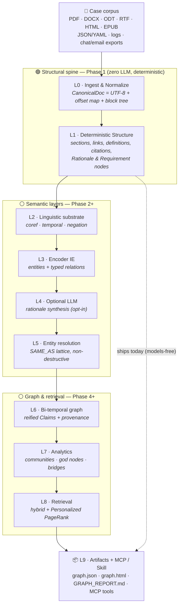
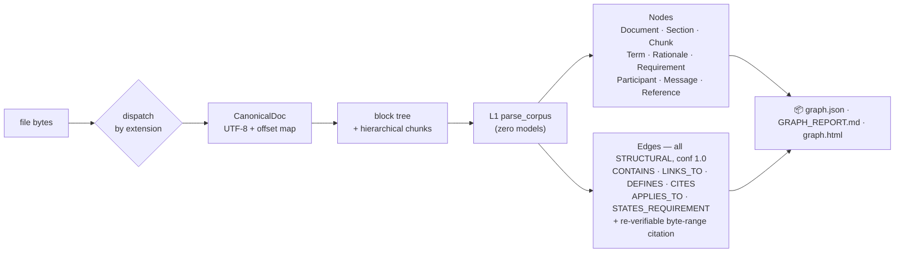

# TextGraph

> Turn a pile of case documents into a **queryable knowledge graph with byte-level provenance on every claim** — local-first, deterministic, and agent-legible.

TextGraph is built to help investigators make sense of **financial-crime and technical-crime** evidence: filings, contracts, wire-transfer logs, SARs, memos, chat/email exports, and reports. It ingests that corpus and emits a structured, versioned graph that shows **who is connected to whom, through what, and — crucially — *why*** — with every edge carrying the exact source span that supports it, so a finding can be re-verified and stands up to audit.

It is the natural-language successor to [**llm-wiki**](https://github.com/krishddd/llm-wiki): where `llm-wiki` gave an agent cited, streaming answers over Wikipedia, TextGraph generalizes that to **any textual corpus** and produces a graph an agent can traverse — multi-hop relationship discovery, contradiction detection, temporal reasoning, and provenance-backed retrieval — not just a stream of prose.

## Who it's for

- **Financial-crime analysts** — trace structuring/layering, link cases through a shared beneficial owner, follow the money across accounts, and answer *why* two cases are related with a cited path.
- **Fraud & technical-crime investigators** — correlate logs, tickets, chat threads, and reports; surface the decision/rationale trail behind an incident.
- **Compliance & audit** — every non-generated claim re-hashes against its source bytes, so evidence is re-verifiable and retained (not silently rewritten).
- **Coding & research agents** — via MCP tools that return bounded, ranked, cited context instead of a bag of similar chunks.

## Supported formats

Investigators don't get clean markdown — they get PDFs, Word docs, and exports. L0 ingests, deterministically:

| Class | Formats | Default install |
|---|---|---|
| Markup / notes | `.md` `.markdown` `.mdx` `.txt` | ✅ built-in |
| Rich documents | `.docx` `.odt` `.rtf` `.html`/`.htm` `.epub` | ✅ built-in (stdlib parsers) |
| Structured data | `.json` `.yaml`/`.yml` `.toml` | ✅ built-in |
| Logs | `.log` (template mining) | ✅ built-in |
| Conversations | `.chat` `.transcript` (speaker turns) | ✅ built-in |
| PDF | `.pdf` | `pip install 'textgraph[ingest]'` (pypdf; Docling for layout/OCR) |

Unknown extensions fall back to plain text; a format needing a missing extra is **skipped with a warning**, never a crash (G2). For rich formats the *extracted* text becomes the canonical document, and every citation still re-verifies against it.

## Quickstart

```bash
uv tool install textgraph        # or: pipx install textgraph
textgraph build ./case-files -o textgraph-out
# → textgraph-out/graph.json, GRAPH_REPORT.md, graph.html, schema.yaml, manifest.json
```

Open `GRAPH_REPORT.md` for orientation (god nodes, rationale, defined terms, and **10 questions the graph can answer well**), or `graph.html` for a self-contained, click-to-source-span explorer.

## Why it exists

`llm-wiki` proved the value of citation-grounded, MCP-exposed knowledge retrieval. TextGraph extends that tool along three axes:

| llm-wiki | TextGraph |
|---|---|
| Answers over Wikipedia | Ingests **any** textual corpus |
| Streamed prose with sources | **Queryable knowledge graph** with byte-range citations on every edge |
| LLM-in-the-loop | **Zero LLM calls required** — deterministic parsers + encoder IE by default (`--no-llm` always works) |
| Point-in-time answer | **Bi-temporal** — what is true, what *was* true, when it changed, and why |

## The one-paragraph pitch

TextGraph turns any body of text into a queryable knowledge graph with byte-level provenance on every claim. Extraction runs entirely on the user's machine using deterministic structural parsers and encoder-based information-extraction models — no LLM calls are required and text never leaves the machine by default. Every edge is tagged `STRUCTURAL`, `EXTRACTED`, `INFERRED`, or `GENERATED`, carries the exact source span that supports it, and is versioned bi-temporally so an agent can ask not just *what is true*, but *what was true, when it changed, and why*.

## Design goals (non-negotiable)

- **G1 — Determinism.** Same corpus + same version ⇒ byte-identical `graph.json`.
- **G2 — Local-first.** Zero network calls by default; any LLM pass is opt-in.
- **G3 — Provenance.** No assertion without a re-verifiable byte-range citation.
- **G4 — Confidence stratification.** Every edge tagged `STRUCTURAL / EXTRACTED / INFERRED / GENERATED`.
- **G5 — Incrementality.** One changed file never forces a full rebuild.
- **G6 — Agent-legible output.** Bounded, ranked, cited context packs — never raw Cypher.
- **G7 — Bounded, auditable cost.** Per-stage token/time/dollar budgets in a run manifest.

## Architecture at a glance

A strictly bottom-up layer stack. Each layer is a **pure function of the layer below it plus a pinned config hash** — the single property that makes determinism (G1) and incrementality (G5) achievable. `L0 → L1` (the structural spine) is implemented and ships today; the semantic and retrieval layers land in later phases.



## Status

🟢 **Phase 1 complete — the deterministic structural spine (L0 + L1) is working.**

- **L0 ingestion** across markdown, plain text, HTML, DOCX, ODT, RTF, EPUB, JSON/YAML/TOML, logs, and transcripts (PDF behind the `[ingest]` extra), each producing a `CanonicalDoc` + span-carrying block tree + hierarchical chunks.
- **L1 structure parse** (zero models): sections, links, definitions, citations, cross-references, transcript threads, log templates, structured fields, and **Rationale / Requirement nodes** (WHY / DECISION / MUST / SHALL …) — the *why* behind the graph. Every edge is `STRUCTURAL` with a re-verifiable byte-range citation.
- **L9 artifacts**: byte-stable `graph.json`, `GRAPH_REPORT.md` (with 10 grounded questions), a self-contained `graph.html` explorer, `schema.yaml`, and `manifest.json`.
- CI gates all of it: lint, strict types, a byte-identical **determinism** gate, and 100% edge-provenance re-verification.

### What Phase 1 does to each file



### What you get (example: an AML case)

A Phase-1 graph over the `chat` + `adr` fixtures — structural, cited, and already answering *why*. Entity/relation extraction (making `Acme Corp` a first-class `Organization` with a `TRANSFERRED` edge) is Phase 2.


> Edges shown are exactly what L1 emits, each carrying a re-verifiable byte-range citation. `SENT_BY` points message → participant, `PARTICIPANT` participant → document, `APPLIES_TO` rationale → the block it justifies.

Next: **Phase 2** — encoder IE (coreference + GLiNER-class entity/relation extraction) turns the structural spine into a full knowledge graph. See [PLAN.md](PLAN.md) for the Phase 0–10 roadmap.

## Specification documents

- [`textgraph-engineering-research.md`](textgraph-engineering-research.md) — the primary engineering specification (L0–L9 stack, model choices, storage, retrieval, evaluation).
- `TextGraph_Engineering_Blueprint.pdf` — slide-deck rendering of the architecture (visual cross-check + UI reference).
- `TextGraph Architecture Gap Analysis.docx` — enterprise extension research (GQL surface, vision-native ingestion, fine-grained access control, Graph-of-Thoughts).

## Related work

- [llm-wiki](https://github.com/krishddd/llm-wiki) — the predecessor tool this project extends.
- **Graphify** — the closest prior art (tree-sitter over *code*); TextGraph recovers its guarantees (determinism, locality, provenance, cost linearity) for the domain of arbitrary natural language.

## License

MIT
