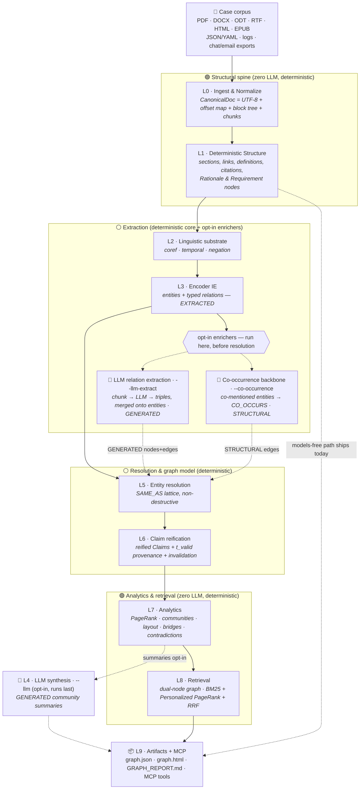
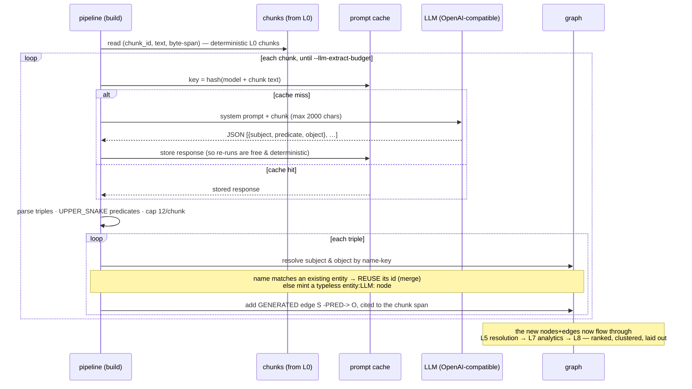
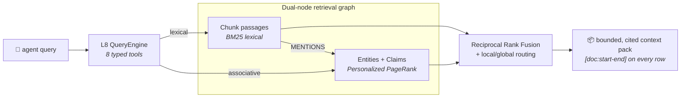
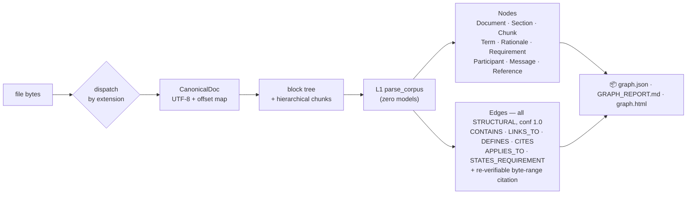
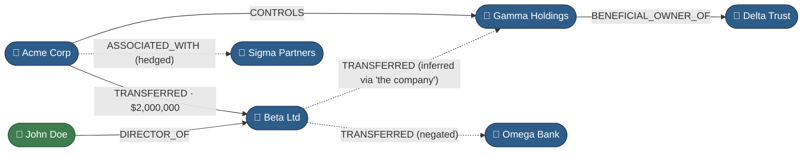

# TextGraph

[](https://pypi.org/project/textgraph-kg/)
[](https://pypi.org/project/textgraph-kg/)
[](https://github.com/krishddd/Wiki_textgraph/actions/workflows/test.yml)
[](https://github.com/krishddd/Wiki_textgraph/actions/workflows/determinism.yml)
[](https://krishddd.github.io/Wiki_textgraph/)
[](LICENSE)

> Turn a pile of case documents into a **queryable, byte-cited knowledge graph** — **deterministic & local-first by default**. Explore it in an **interactive graph studio**, derive new relations with **link prediction & Datalog rules**, and layer **opt-in LLM extraction, grounded answer synthesis, and semantic search** on top (always `GENERATED`-quarantined, never masquerading as ground truth).
>
> **`pip install textgraph-kg`**  ·  **[Live demo →](https://krishddd.github.io/Wiki_textgraph/)**  ·  **[vs. Semantica →](docs/COMPARISON_SEMANTICA.md)**

TextGraph is built to help investigators make sense of **financial-crime and technical-crime** evidence: filings, contracts, wire-transfer logs, SARs, memos, chat/email exports, and reports. It ingests that corpus and emits a structured, versioned graph that shows **who is connected to whom, through what, and — crucially — *why*** — with every edge carrying the exact source span that supports it, so a finding can be re-verified and stands up to audit.

It is the natural-language successor to [**llm-wiki**](https://github.com/krishddd/llm-wiki): where `llm-wiki` gave an agent cited, streaming answers over Wikipedia, TextGraph generalizes that to **any textual corpus** and produces a graph an agent can traverse — multi-hop relationship discovery, contradiction detection, temporal reasoning, and provenance-backed retrieval — not just a stream of prose.

## Works out of the box (zero config)

`pip install textgraph-kg` → `textgraph build ./docs` already does the investigator happy
path — **no flags, no extras, no API key, no server:**

- 📄 **PDFs ingest by default** — `pypdf` is a *core* dependency (investigators live in PDFs). `.docx`/`.html`/`.epub`/logs/chat too. (Docling layout/table/OCR is the only opt-in, in `[ingest]`.)
- 🔗 **Entity resolution is on by default** — `Acme Corporation` / `Acme Corp` / `ACME` collapse to one canonical identity via cited `SAME_AS`, so a query for one reaches facts filed under the others. Deterministic rules backend; Splink stays optional in `[er]`.
- 🔎 **Hybrid retrieval by default** — BM25 + Personalized-PageRank + RRF, every hit cited.
- 🧠 **LLM & embeddings are opt-in** — `--llm-extract`, `--narrate`, `--embed` layer on top, always `GENERATED`-quarantined; the default stays deterministic and offline.

Numbers for the PDF + entity-resolution defaults (before/after) are in [BENCHMARKS.md](BENCHMARKS.md#zero-config-defaults-pdf--entity-resolution).

## Why it's different (vs "GraphRAG")

Most GraphRAG tools build the graph *with an LLM*: extraction is non-deterministic, edges arrive without verifiable sources, and you can't reproduce or audit the result. TextGraph inverts that. The edge is **trust**, not just recall:

- **🔁 Deterministic by construction.** The same corpus always produces a **byte-identical `graph.json`** — gated in CI. You can diff two runs and reproduce any finding exactly.
- **🔍 Byte-level provenance on every edge.** Each non-generated claim carries the exact `[doc:start-end]` span that supports it, and **re-hashes against source bytes** — 100% re-verification is gated (`test_edge_provenance`). Most peers offer chunk-level attribution at best.
- **🚫 Zero LLM calls by default.** The whole pipeline — ingest → IE → resolution → claims → analytics → retrieval — runs **locally, CPU-only, no API key**. LLMs are opt-in, quarantined, and `GENERATED`-tagged so they can never masquerade as ground truth.
- **🕓 Bi-temporal versioning.** Claims carry `[t_valid, t_invalid)` windows; a later fact **invalidates** an earlier one (with a cited `SUPERSEDES` edge) rather than overwriting it — so history is queryable, not lost.
- **📏 Honest about quality.** We publish the **hallucinated-edge rate** (0.167 on the fixture, [BENCHMARKS.md](BENCHMARKS.md)) — a number most systems don't report at all.

Local-first / DuckDB stays the default; a graph DB (Neo4j) is an *optional* scale-out backend, never required. The trade is deliberate: the deterministic default caps peak recall vs an LLM extractor, which is exactly why the higher-recall `[ie]` and opt-in LLM paths exist — but the reproducibility and re-verifiable citations are the moat.

## TextGraph vs. Semantica

[Semantica](https://github.com/semantica-agi/semantica) is the closest peer — same regulated-domain focus, PROV-O provenance, decision intelligence (`record_decision` / `trace_decision_chain` / `find_similar_decisions`), conflict detection, and bi-temporal facts. Independent convergence on the same shape is a good sign. Here's the honest split ([full comparison →](docs/COMPARISON_SEMANTICA.md)):

**✅ Where TextGraph leads**

- **Byte-identical builds, gated in CI** — diff two runs, reproduce any finding. (Semantica guarantees deterministic *reasoning*, not a byte-identical *build*.)
- **Re-hashable byte-span citations** — every non-generated edge re-verifies against source bytes; 100% re-verify is gated. (Stronger than document/field-level provenance.)
- **Zero-LLM, dependency-free core** — the whole default pipeline runs CPU-only, no API key, no vector DB. LLM/embeddings are opt-in and `GENERATED`-quarantined.
- **Interop with provenance intact** — `textgraph export` emits **RDF/Turtle** (loads into Oxigraph/Jena/any SPARQL store, with cited spans as reified `rdf:Statement`s), an **OWL** vocabulary, a **SHACL** shapes graph, and a **PROV-O** decision trail — all deterministic.

**🧭 Where to improve (roadmap)**

- **Structural link prediction** — `predict_links` (Adamic-Adar / common-neighbours / resource-allocation) suggests likely-missing relations from topology, deterministically. `textgraph predict`, a **Predict links** tool in the console Ask dock, and candidate edges drawn dashed on the graph. (Node2Vec graph embeddings are still on the roadmap.)
- **LPG storage backends** — Semantica is polyglot (RDF *and* labeled-property graphs: Neo4j/Neptune/AGE). TextGraph now exports **openCypher** (`export --format cypher`) so the graph — with its `ConfidenceTag` + byte-span citations as edge properties — loads straight into Neo4j / Memgraph / AGE / Neptune, plus RDF/OWL/SHACL for triple stores. A live bidirectional driver (`serve --backend neo4j`, [designed](docs/plans/neo4j-backend.md)) is the next step.
- **Rule reasoning** — a deterministic **forward-chaining Datalog subset** (`textgraph/reasoning/`, `textgraph rules`, and a **Rules** console tool) derives new relations from recursive IF/THEN rules with a full derivation trace for every inferred fact. (Semantica also has Rete/SPARQL; those remain on the roadmap.)
- **Provider & vector-store breadth** — Semantica spans LiteLLM providers and FAISS/Qdrant/Weaviate/Milvus. TextGraph ships one OpenAI-compatible client (chat + embeddings) + a cosine index; more backends welcome.
- **Ecosystem polish** — Semantica has a hosted docs site and published benchmarks. TextGraph has an **MCP server**, a **REST API** (the console's `/api/*`), a **live demo**, and honest fixture benchmarks ([BENCHMARKS.md](BENCHMARKS.md)) — and is growing the rest.

The design rule that keeps the moat while closing the gap: **the LLM augments, it never becomes ground truth** — anything model-authored is `GENERATED`-tagged next to its re-verifiable citations.

## Who it's for

- **Financial-crime analysts** — trace structuring/layering, link cases through a shared beneficial owner, follow the money across accounts, and answer *why* two cases are related with a cited path.
- **Fraud & technical-crime investigators** — correlate logs, tickets, chat threads, and reports; surface the decision/rationale trail behind an incident.
- **Compliance & audit** — every non-generated claim re-hashes against its source bytes, so evidence is re-verifiable and retained (not silently rewritten).
- **Coding & research agents** — via MCP tools that return bounded, ranked, cited context instead of a bag of similar chunks.

## Supported formats

Investigators don't get clean markdown — they get PDFs, Word docs, and exports. L0 ingests, deterministically:

| Class | Formats | Default install |
|---|---|---|
| Markup / notes | `.md` `.markdown` `.mdx` `.txt` | ✅ built-in |
| Rich documents | `.docx` `.odt` `.rtf` `.html`/`.htm` `.epub` | ✅ built-in (stdlib parsers) |
| Structured data | `.json` `.yaml`/`.yml` `.toml` | ✅ built-in |
| Logs | `.log` (template mining) | ✅ built-in |
| Conversations | `.chat` `.transcript` (speaker turns) | ✅ built-in |
| PDF (text layer) | `.pdf` | ✅ built-in (pypdf) — investigators live in PDFs |
| PDF layout / tables / OCR | scanned or complex `.pdf` | `pip install 'textgraph-kg[ingest]'` (Docling) |

Unknown extensions fall back to plain text; a format needing a missing extra is **skipped with a warning**, never a crash (G2). For rich formats the *extracted* text becomes the canonical document, and every citation still re-verifies against it.

## Quickstart

> New here? **[docs/RUNNING.md](docs/RUNNING.md)** is the step-by-step guide — which Python,
> which requirements file, how to install with `pip` **or** `uv`, how to build a graph, and
> how to open the interactive UI.

```bash
pip install textgraph-kg          # the import package + CLI are named `textgraph`
```

**Python API** — build once, then call the eight typed, cited tools:

```python
from textgraph.pipeline import build
from textgraph.l8_retrieval import QueryEngine

result = build("./case-files")  # deterministic; byte-identical graph.json
engine = QueryEngine(result.nodes, result.edges)

hits = engine.search("who transferred funds to whom", k=5)
for h in hits.hits:
    print(h.name, "→", [c.ref() for c in h.citations])  # every hit re-verifiable

engine.path("Acme Corp", "Gamma Holdings")  # max-likelihood cited path
engine.why("Acme Corp")  # cited claims + validity windows
engine.conflicts()  # single-truth conflicts, surfaced not merged
engine.trace_decision_chain("beneficial owner policy")  # decision lineage
```

**In a Jupyter notebook** (`pip install 'textgraph-kg[notebook]'`) — the graph inline, answers as citation-bearing DataFrames:

```python
from textgraph.notebook import TextGraph

tg = TextGraph("./case-files")  # build a corpus (or load a graph.json / .duckdb)
tg.show()  # the interactive canvas, rendered in the cell
tg.search("who moved the money")  # -> DataFrame, one [doc:start-end] citation per row
tg.roles("Acme Corp")  # -> structurally similar entities (shell patterns)
tg.contradictions()  # -> contested claims + a resolution hint
```

Every method returns the same bounded, cited results as the CLI/MCP tools — as a `pandas.DataFrame` (citations in a column), degrading to a list of dicts if pandas is absent. Read-only; nothing is written.

**CLI** — the same tools from the shell:

```bash
# ...or from source (dev): pip install -r requirements.txt && pip install -e .
textgraph build ./case-files -o textgraph-out
# → textgraph-out/graph.json, GRAPH_REPORT.md, graph.html, schema.yaml, manifest.json

# Then query the graph directly — bounded, byte-cited answers, no LLM required:
textgraph query   ./case-files "who transferred funds to whom"
textgraph path    ./case-files "Acme Corp" "Gamma Holdings"
textgraph explain ./case-files "Acme Corp"           # cited claims + validity windows
textgraph timeline ./case-files "Acme Corp"          # what was true, and when it changed
textgraph contradictions ./case-files                # conflicting assertions, cited

# Keep the graph in sync with a live case folder (incremental, only re-extracts edits):
textgraph watch ./case-files -o textgraph-out

# ...or open the interactive graph console (canvas viewer + all eight tools):
textgraph console ./case-files          # -> http://127.0.0.1:8765

# For a denser, meaning-rich map, build with LLM relation extraction first, then serve it:
textgraph build ./case-files --llm-extract --llm-extract-budget 200 -o ./case-out
textgraph console ./case-out            # shows every LLM-extracted X -PRED-> Y relation

# ...or query it in standard GQL (ISO/IEC 39075 / Cypher subset):
textgraph gql ./case-files "MATCH (a:Organization)-[:CONTROLS*1..3]->(b) RETURN a.name, b.name"
```

The console is a clean, spacious viewer that surfaces your data at a glance: a row of **stat cards** (entities · relations · communities · time points), a **NotebookLM / Semantica-style mind-map** — nodes coloured by entity type (with a legend) and sized by PageRank, self-organised by a client-side force layout so connected entities cluster and the map fills the whole panel (a ↔ toggle collapses the side panel for full width). When a build has few explicit relations, the console links entities that **co-occur in the same passage** so the graph still spreads instead of scattering; opt-in **LLM-extracted relations are always shown** (their endpoints are pulled into view regardless of PageRank rank, so the meaningful `X →REGULATES→ Y` edges surface). Alongside: an **"Ask" chat dock** — ask a question in plain English and it routes to the right graph tool, answers with cited evidence (and a collapsible reasoning chain), and highlights the answer on the graph beside it. **By default the answer is deterministic** (a templated, cited summary — no LLM, works offline); **when an LLM endpoint is configured** (`MODEL_BASE_URL` / `MODEL_NAME` / `API_KEY` in the environment), open questions are automatically recomposed as **natural-language prose** over the same cited evidence — flagged *"natural language · LLM"* and `GENERATED`-quarantined, with the re-verifiable citations kept underneath. So `textgraph console` "just answers in plain English" the moment an LLM is available, and stays deterministic when it isn't. The dock is **multi-turn**: a follow-up like *"who else is connected to them?"* keeps the previous subject; clicking a `[doc:span]` citation opens a **source panel** with the exact cited bytes, re-verified against the file; and each answer offers **deterministic follow-up chips** plus a collapsible *"how this was answered"* trace. Then: a **Top-entities-by-PageRank** list, a communities panel with per-cluster toggles, a confidence-tag filter (so `GENERATED` output stays visibly quarantined), a **relation-type filter** (per-predicate chips with counts, plus a **Semantic only** shortcut that hides the `CO_OCCURS` backbone so only stated relations remain), search that highlights matches, **click-to-inspect** for a node's cited claims and validity windows, **collaborative review** (`--analyst NAME` + a shared `--annotations` sidecar: attributed confirmed/disputed/pending marks, per-entity assignments, a live team-activity feed, and an "assigned to me" filter — all in the sidecar, never in `graph.json`), in-UI **document management** (attach / remove with `--allow-ingest`), a path mode that traces the maximum-likelihood chain between two entities, a time slider (with a **play button** that animates relations appearing/disappearing over time), a **contradiction heatmap** that tints entities by contested-claim load, a **mini-map** overview you can drag to pan, and a light / dark toggle. The browser only ever *draws* and *arranges* the graph the server ships — no CDN, no framework, no third-party JS; `graph.json` stays byte-identical. The offline `graph.html` artifact is the exact same viewer. See **[docs/RUNNING.md](docs/RUNNING.md)** for a walkthrough.

Open `GRAPH_REPORT.md` for orientation (god nodes, communities, contradictions, and **10 questions the graph can answer well**), or `graph.html` for a self-contained, click-to-source-span explorer. Agents drive the same eight typed tools over MCP — see [`textgraph.mcp`](textgraph/mcp/).

## Collaborative review — a walkthrough

Two analysts, Dana and Reed, work one case together. `graph.json` stays the immutable shared
ground truth; every human judgment lives in a shared **sidecar** that both consoles read and write.

**1. Build the case once** (the reproducible artifact everyone agrees on):

```bash
textgraph build ./case-files -o ./case-out       # -> case-out/graph.json
```

**2. Each analyst opens the same graph, pointing at one shared sidecar**, with their own name:

```bash
# Dana's machine (or terminal)
textgraph console ./case-out --annotations //share/case/collab.json --analyst "Dana"
# Reed's machine
textgraph console ./case-out --annotations //share/case/collab.json --analyst "Reed"
```

The `--annotations` file is the only thing they share (a network path, a synced folder, or the same
box on two ports). `--analyst` is your name for **attribution** — it is *not* access control (use
`--token` or the [access policy](#) for that).

**3. Work the case.** Click a node to open the inspector, then:

- **Mark it** confirmed / disputed / pending and leave a note — stamped *"last edited by Dana"* with a time.
- **Assign it** — type a teammate's name (or hit **Assign to me**). Assigned entities show an `@name` cue on the canvas.
- The node's status shows as a coloured ring badge; the graph is the same for both analysts.

**4. See each other, live.** Each console polls the sidecar every few seconds:

- When Reed marks an entity disputed, it appears in **Dana's** console within seconds — no reload.
- The **Team activity** panel shows the running log: *"Reed marked disputed — Beta Ltd"*, *"Dana assigned to Reed — Acme Corp"*.
- The **Mine** button (top bar) fades everything not assigned to you, so each analyst can focus on their queue.

**5. It's all in the sidecar.** `collab.json` holds the annotations, assignments, a version counter,
and the activity log — with authors and timestamps. `graph.json` is never touched and stays
byte-identical, so the determinism gate is unaffected and the case is still perfectly reproducible.
A v4.11 single-analyst `annotations.json` upgrades in place. Two console processes on one file
reload-before-write (and before-read), so they see each other and never clobber each other's work.

## Why it exists

`llm-wiki` proved the value of citation-grounded, MCP-exposed knowledge retrieval. TextGraph extends that tool along three axes:

| llm-wiki | TextGraph |
|---|---|
| Answers over Wikipedia | Ingests **any** textual corpus |
| Streamed prose with sources | **Queryable knowledge graph** with byte-range citations on every edge |
| LLM-in-the-loop | **Zero LLM calls required** — deterministic parsers + encoder IE by default (`--no-llm` always works) |
| Point-in-time answer | **Bi-temporal** — what is true, what *was* true, when it changed, and why |

## The one-paragraph pitch

TextGraph turns any body of text into a queryable knowledge graph with byte-level provenance on every claim. Extraction runs entirely on the user's machine using deterministic structural parsers and encoder-based information-extraction models — no LLM calls are required and text never leaves the machine by default. Every edge is tagged `STRUCTURAL`, `EXTRACTED`, `INFERRED`, or `GENERATED`, carries the exact source span that supports it, and is versioned bi-temporally so an agent can ask not just *what is true*, but *what was true, when it changed, and why*.

## Design goals (non-negotiable)

- **G1 — Determinism.** Same corpus + same version ⇒ byte-identical `graph.json`.
- **G2 — Local-first.** Zero network calls by default; any LLM pass is opt-in.
- **G3 — Provenance.** No assertion without a re-verifiable byte-range citation.
- **G4 — Confidence stratification.** Every edge tagged `STRUCTURAL / EXTRACTED / INFERRED / GENERATED`.
- **G5 — Incrementality.** One changed file never forces a full rebuild.
- **G6 — Agent-legible output.** Bounded, ranked, cited context packs — never raw Cypher.
- **G7 — Bounded, auditable cost.** Per-stage token/time/dollar budgets in a run manifest.

## Architecture at a glance

A strictly bottom-up layer stack. Each layer is a **pure function of the layer below it plus a pinned config hash** — the single property that makes determinism (G1) and incrementality (G5) achievable. `L0 → L1` (the structural spine) is implemented and ships today; the semantic and retrieval layers land in later phases.



> **Where the LLM fits (and where it does not).** The deterministic core — **L0 → L1 → L2/L3 → L5 → L6 → L7 → L8** — never calls a model. The LLM appears at exactly **two opt-in touchpoints**, both `GENERATED`-quarantined: **relation extraction** (`--llm-extract`, an *input* enricher that runs **before** resolution/analytics so its entities are ranked, clustered, and laid out like any other) and **synthesis** (`--llm` / `--narrate`, an *output* pass that summarizes finished communities or narrates a cited answer). Turn both off and the build is byte-identical (G1); the next section traces the extraction path end to end.

## How a build actually runs (the backend workflow)

`textgraph build` is a single deterministic function (`textgraph/pipeline.py::build`) that runs the layers **in this exact order**. Each step is a pure function of the step before it plus the pinned config hash — that is what makes the output byte-identical (G1) and incremental (G5). Steps marked *opt-in* are skipped entirely unless their flag is set, so the default build touches no model and no network.

| # | Stage | What it does | Tag | Default |
|---|-------|--------------|-----|---------|
| 1 | **L0 ingest** | Each file → `CanonicalDoc` (UTF-8 + raw-byte offset map) + block tree + hierarchical **chunks** (the unit the LLM later reads). | — | on |
| 2 | **L1 structure** | Zero-model parse: sections, links, definitions, citations, Rationale/Requirement/Decision nodes. | `STRUCTURAL` | on |
| 3 | **L2 + L3 encoder IE** | Deterministic entities (Org/Person/Money/Date/…) + typed relations (`TRANSFERRED`, `CONTROLS`, `DIRECTOR_OF`, …); coref-lite; negation/modality preserved. | `EXTRACTED` / `INFERRED` | on |
| 4 | **🧠 LLM relation extraction** | *(opt-in `--llm-extract`)* runs the LLM over the L0 chunks and adds the relations the deterministic pass missed — **detailed below**. | `GENERATED` | off |
| 5 | **🔗 Co-occurrence backbone** | *(opt-in `--co-occurrence`)* links entities co-mentioned in one chunk, cited by the shared span, so a relation-sparse corpus still forms a connected graph. | `STRUCTURAL` | off |
| 6 | **L5 entity resolution** | Alias entities (`Acme Corp` / `ACME`) collapse to one canonical identity via reversible `SAME_AS`. Runs **after** steps 4–5, so LLM/co-occurrence entities are resolved too. | `INFERRED` | on |
| 7 | **L6 claims + temporal** | Every relation becomes a citable `Claim` with a `[t_valid, t_invalid)` window; a dated correction **invalidates** (never deletes) via a cited `SUPERSEDES` edge. Conflict detection/resolution runs here. | `INFERRED` | on |
| 8 | **L7 analytics + layout** | Weighted PageRank, Brandes betweenness, label-propagation communities, deterministic force-layout coordinates, god nodes, bridges, `CONTRADICTS`. **A build invariant asserts every entity leaves this stage ranked, clustered, and positioned** — the guard that keeps LLM entities from becoming "floating dots." | `INFERRED` | on |
| 9 | **L8 retrieval graph** | Emits `Chunk` nodes + `chunk —MENTIONS→ entity` links: the HippoRAG-style dual-node graph the eight typed tools search (BM25 + Personalized PageRank + RRF). | `STRUCTURAL` | on |
| 10 | **🧠 L4 LLM synthesis** | *(opt-in `--llm`)* summarizes the finished communities into `GENERATED` `Summary` nodes. Independent of extraction. | `GENERATED` | off |
| 11 | **L9 artifacts** | Byte-stable `graph.json`, `GRAPH_REPORT.md` (now with a **graph-health** panel), self-contained `graph.html`, `schema.yaml`, `manifest.json`. | — | on |

### How the LLM relation extraction works (step 4, in detail)

This is the pass that turns a pile of prose into a NotebookLM-style **meaning graph** — `X →TRANSFERRED→ Y`, `A →CONTROLS→ B` — while keeping every model-authored edge quarantined and cited. It lives in `textgraph/l4_llm_optional/extract.py` and is driven from `pipeline._run_llm_extract`.



Concretely, for each chunk (bounded by `--llm-extract-budget`, default 40, so cost is capped and auditable — G7):

1. **Prompt & cache.** A strict system prompt asks for *only* a compact JSON array of `{subject, predicate, object}` triples with `UPPER_SNAKE_CASE` predicates. The request is keyed by `hash(model + chunk text)` and cached on disk, so a re-run makes **zero** new calls and produces the **same** graph — the property that lets an LLM pass stay deterministic given a fixed model.
2. **Parse.** The response is parsed tolerantly (markdown fences, stray prose stripped); predicates are normalized to `UPPER_SNAKE_CASE`; at most 12 triples per chunk so one noisy passage can't flood the graph.
3. **Merge-by-construction.** Each endpoint name is normalized to a key. **If the deterministic pipeline already produced an entity with that key, the triple reuses that node's id** — so the LLM relation attaches to the real, ranked, laid-out entity instead of spawning a duplicate dot. Otherwise a typeless `entity:LLM:` node is minted (L5 then fuzzy-links the near-misses). Provenance lives on `source: "llm"` + the `GENERATED` edge tag — never on the entity type.
4. **Emit, cited.** A `GENERATED` relation edge `subject —PRED→ object` is created, confidence `0.5`, carrying the **byte span of the chunk it came from** — a coarse but real, re-verifiable citation (G3).
5. **Flow downstream.** Because this all happens **before** L5/L7, those new entities go through entity resolution, PageRank, community detection, and force-layout exactly like deterministic ones. That ordering (fixed in v4.7.0) is why LLM relations now appear as first-class, positioned, labelled nodes rather than a ring of unranked dots at the origin.

**The quarantine guarantee.** Merging node *identity* never launders an edge's tag: the `GENERATED` marker lives on the **edge**, so a model-authored relation between two otherwise-`EXTRACTED` entities stays `GENERATED` and filterable. In the console, the confidence-tag filter can hide every `GENERATED` edge in one click; in `graph.json`, they carry `tag: "GENERATED"`. With `--llm-extract` off, the pass is a complete no-op and the build is byte-identical.

### Run it

```bash
export API_KEY=…                        # read from the environment ONLY — never persisted, never in the config hash
export MODEL_BASE_URL=https://…/v1      # any OpenAI-compatible /chat/completions — OpenAI, vLLM, Ollama, LM Studio
export MODEL_NAME=your-model            # e.g. a local Nemotron / Llama, or gpt-4o-mini

# Build a meaning-rich graph: deterministic core + LLM relations + co-occurrence backbone.
textgraph build ./case-files --llm-extract --llm-extract-budget 200 --co-occurrence -o ./case-out

# Serve it — every LLM-extracted X -PRED-> Y relation is shown, GENERATED-tagged and cited.
textgraph console ./case-out
```

`--llm-extract-budget N` dials the density (more chunks read → more relations, all cached). `--co-occurrence` is independent and free (no model) — it guarantees connectivity even before any LLM relations exist. The API key is read from the environment only; it never enters `graph.json`, the config hash, or the manifest.

## Status

🟢 **v5.3.0 — bounding-box provenance on PDF citations.** Building on v5.2's page numbers, citations from PDFs now also carry an **`(x0,y0,x1,y1)` bounding box** in PDF points — derived in the **default install** from pypdf's own glyph coordinates (no heavy extra), so the proven text/segmentation is untouched and the box is layered on deterministically. It rides along in the **openCypher** (`r.bbox`) and **RDF** (`tgo:sourceBBox`) exports and the console chip's tooltip — the groundwork for **clickable-to-region** citation view. Strictly additive: the byte range is still the identity, a scanned page degrades to page-only, and the field is **omitted from `graph.json` when absent**, so text-only corpora and every pre-5.3 graph stay byte-identical.

🟢 **v5.2.0 — page provenance on every citation.** Citations from paged documents (PDFs) now carry a **1-based page number**, so a span renders as **`[p.4 blake3:…:120-145]`** in the console and the offline `graph.html`, and rides along as an edge property in the **openCypher** (`r.page`) and **RDF** (`tgo:sourcePage`) exports. It's strictly additive — the byte range is still the identity, re-verification never consults the page, and the field is **omitted from `graph.json` when unknown**, so text-only corpora and every pre-5.2 graph stay byte-identical. Groundwork for the follow-up **bbox / clickable-to-region** enrichment on the `[ingest]` Docling path (v5.3.0).

🟢 **v5.1.1 — the Ask dock now answers in natural language.** When an LLM endpoint is configured (`MODEL_*` env), open questions in the console chat are auto-recomposed as **plain-English prose** over the same cited evidence — flagged *"natural language · LLM"*, `GENERATED`-quarantined, citations kept underneath. Previously you got a terse templated summary unless you manually picked the Narrate dropdown. With no LLM set, answers stay deterministic and cited, so the offline moat is untouched.

🟢 **v5.1.0 — the opt-in extras: temporal algebra, vocabulary export, learned embeddings.** `textgraph allen` surfaces the 13 **Allen interval relations** between dated claims (*this transfer happened **during** that directorship*) from the bi-temporal windows — deterministic, no dependency. `textgraph export --format skos` emits the communities as a **SKOS concept scheme** (topics → entities, with `SAME_AS` aliases as `skos:altLabel`s). And `textgraph roles --backend node2vec` adds **learned Node2Vec embeddings** behind the `[graph]` extra as an opt-in alternative to the deterministic role signatures — it degrades cleanly to the default (with a note) when the extra isn't installed, so the moat's default stays reproducible. Plus a collaborative-review walkthrough in the README.

🟢 **v5.0.0 — collaborative mode (multi-analyst review).** Point two consoles at the same sidecar (`console --annotations shared.json --analyst "Dana"` / `--analyst "Reed"`) and a case team works together **live**: every edit is attributed (author + time), entities can be **assigned** to an analyst, a **team-activity feed** shows who did what, and a colleague's change appears within seconds via version-polling (no websockets). `graph.json` stays the immutable shared ground truth — never written; all mutable state lives in the sidecar, so the determinism gate is untouched. Declared identity is for attribution, **not access control** (that's `--token` / the policy). A **milestone** bump: the roadmap of bigger bets (roles, federation, Jupyter, collaboration) is complete — no breaking changes, the API and `graph.json` format are unchanged.

🟢 **v4.14.0 — Jupyter integration.** `pip install 'textgraph-kg[notebook]'` → `from textgraph.notebook import TextGraph`: `tg.show()` renders the interactive graph canvas **inline in a cell** (the same self-contained offline viewer, in a sandboxed iframe — no server), and `tg.search(...)` / `tg.roles(...)` / `tg.relations()` / `tg.contradictions()` return **citation-bearing `pandas.DataFrame`s** (one `[doc:start-end]` per row). pandas/IPython are import-guarded, so the methods degrade to lists of dicts without them and the lean core install is untouched. Read-only — nothing writes `graph.json`.

🟢 **v4.13.0 — structural role similarity (shell-pattern detector).** `textgraph roles <path> "Acme Holdings"` finds the entities that play the same *structural role* — the next shell company with the same shape (one controller in, money out to several fronts), even when it shares no name, document, or neighbor with the known one. Deterministic by design: after a [design pass](docs/plans/structural-roles.md) rejected Node2Vec (stochastic, proximity-not-role, heavy dep), each entity gets a **structural signature** of local topology invariants (degree structure, centrality, clustering, relation-type mix), z-scored and compared by cosine — no RNG, no training, no new dependency, reproducible by construction. Also a **Similar roles** tool in the console. Composes with `federate` for cross-case role matching.

🟢 **v4.12.0 — cross-graph federation.** `textgraph federate caseA/graph.json caseB/graph.json …` finds the entities that span multiple cases — the shared beneficial owner, the recurring account — **without merging the corpora**. The match is exact, not fuzzy: entity ids are content-addressed, so the same real-world entity carries the same id in every case that names it (the same insight behind `diff`). `--entity NAME` prints a cross-case dossier (its relations in each case); `--min-cases N` and `--json` too. Deterministic, zero new deps.

🟢 **v4.11.0 — diff & the analyst loop.** `textgraph diff A B` shows exactly what changed between two builds — entities, relations, contradictions, community moves — deterministically (content-addressed identity; communities compared by membership, not their renumbered ids). `textgraph watch --webhook URL` posts a Slack/Teams diff summary on every rebuild (`--watchlist` scopes it to key entities). The console closes the analyst loop: each contradiction gets a **resolution hint** ("recommends B — the June correction supersedes the May assertion"), and entities can be marked **confirmed / disputed / pending** with notes in an `annotations.json` sidecar that never touches `graph.json`. Plus `textgraph cache status` to check if an `--llm` rebuild will be free.

🟢 **v4.10.0 — reading the map.** Three visualization upgrades turn a dense graph into something you can scan: a **play button** animates the time slider so relations appear/disappear as claims become valid/invalid; a **contradiction heatmap** (Heat) tints entities by contested-claim load so the disputed zones stand out; and a **mini-map** gives a corner overview with a viewport box you can drag to pan. All client-side, all in the offline `graph.html` too; the only backend change is an additive per-entity `contradictions` count.

🟢 **v4.9.0 — the Ask dock is now a conversation.** Multi-turn memory resolves follow-ups that lean on the previous turn (*"who else is connected to **them**?"* keeps the subject) — deterministically, no LLM. Clicking a `[doc:span]` citation opens a **source panel** showing the exact cited bytes, re-hashed against the file and marked *verified*. Each answer offers **deterministic follow-up chips** derived from what it returned, and a collapsible **"how this was answered"** routing trace. New `POST /api/ask` (with `session_id`) exposes the same multi-turn, cited answers to external callers. All server-side; the offline `graph.html` degrades gracefully to inert citations.

🟢 **v4.8.0 — filter the map by relation type.** The console now lists every predicate as a chip with its edge count — click to show/hide `TRANSFERRED`, `CONTROLS`, `CO_OCCURS`, `SAME_AS` independently — plus a **Semantic only** shortcut that hides the co-occurrence backbone and leaves just the meaning relations (press again to restore). Confidence-tag filtering couldn't do this: a co-occurrence scaffold and a stated relation are both `STRUCTURAL`. Drawing, degree, neighbours and ego distance all share one filter test, so hiding the backbone honestly re-derives which nodes are held up by semantic relations alone. View-only — `graph.json` is untouched, and the offline `graph.html` gets it too.

🟢 **v4.7.0 — connected graphs, not floating dots.** A pipeline-ordering fix makes LLM-extracted entities first-class — resolved, ranked, clustered and laid out like every other node (previously they landed at the origin, unranked, as a field of dots). New `build --co-occurrence` links entities co-mentioned in a chunk with byte-cited `STRUCTURAL` edges so a relation-sparse corpus still forms a connected, clustered map. The console fades unconnected nodes by default (toggle **F**), always labels the top entities, and `GRAPH_REPORT.md` gains a graph-health panel (orphan %, duplicate-name candidates). All opt-in; the deterministic baseline is unchanged.

🟢 **v4.6.0 — openCypher export → Neo4j.** `textgraph export --format cypher` emits a deterministic load script that recreates the graph — citations and confidence tags included — in Neo4j / Memgraph / AGE / Neptune. The DB is a downstream materialization target; the build stays local & deterministic.

🟢 **v4.5.0 — graph interaction polish.** Click glides the camera with a selection halo, click-again / Escape undoes, the top search pans to matches, and Group lays communities out as separated readable clusters.

🟢 **v4.4.0 — studio-style console chrome.** A left rail, a segmented top toolbar, and collapsible inspector sections give the console a clean knowledge-studio layout.

🟢 **v4.3.0 — forward-chaining rule engine (Datalog).** Derive new relations from recursive IF/THEN rules with a full derivation trace: `textgraph rules`, a **Rules** console tool, and `QueryEngine.apply_rules`. Closes the Semantica reasoning-engine gap.

🟢 **v4.2.0 — ego / distance-intelligence view.** An **Ego** toggle colours the graph by hop-distance from a clicked focus node (0h / 1h / 2–3h / 4+h) with a live depth slider — a distance map for exploring a node's structural reach.

🟢 **v4.1.0 — structural link prediction.** Suggest likely-missing relations from graph topology (Adamic-Adar and friends), deterministically: `textgraph predict`, a **Predict links** tool in the console, and dashed candidate edges on the graph. Closes the last big Semantica KG-engine gap (Node2Vec embeddings aside).

🟢 **v4.0.0 — NotebookLM-style graph console.** The web console now self-organises into a mind-map: a client-side force layout clusters connected entities and fills the panel, a co-occurrence backbone connects entities that share a passage so even a relation-sparse build spreads, and opt-in **LLM-extracted relations are always shown** (their endpoints are pulled into view regardless of PageRank, so the meaningful `X →REGULATES→ Y` edges surface). `build --llm-extract-budget N` dials the LLM relation density. `graph.json` and the determinism/provenance gates are untouched.

🟢 **v1.0.0 — the full L0–L9 stack is shipped** (deterministic ingest → IE → resolution → bi-temporal claims → analytics → hybrid retrieval → optional LLM, with CLI, MCP, and a local web console).

- **L0 ingestion** across markdown, plain text, HTML, DOCX, ODT, RTF, EPUB, JSON/YAML/TOML, logs, and transcripts (PDF behind the `[ingest]` extra), each producing a `CanonicalDoc` + span-carrying block tree + hierarchical chunks.
- **L1 structure parse** (zero models): sections, links, definitions, citations, cross-references, transcript threads, log templates, structured fields, and **Rationale / Requirement nodes** (WHY / DECISION / MUST / SHALL …). Every edge is `STRUCTURAL` with a re-verifiable byte-range citation.
- **L2 + L3 encoder IE** — the build now extracts **entities** (Organization, Person, Money, Account, Date, Email) and **typed relations** (`TRANSFERRED` with amount, `CONTROLS`, `BENEFICIAL_OWNER_OF`, `DIRECTOR_OF`, `ASSOCIATED_WITH`), tagged `EXTRACTED`. Coreference-lite resolves `it`/`the company` to the nearest org (relations so resolved are tagged `INFERRED`), and **negation/modality are preserved** (`did not transfer` → negated; `may be linked` → hedged). The default backend is deterministic and model-free (CPU-only, CI-safe); a higher-recall GLiNER backend lives behind the `[ie]` extra and runs an **int8-quantized ONNX** model so it's usable on CPU (GLiNER supplies the NER; relations reuse the same deterministic extractor, so recall rises with no new nondeterminism).
- **L5 entity resolution — on by default, no extra needed.** Alias entities collapse to one canonical identity out of the box: `Acme Corp` / `Acme Corporation` / `ACME` → **"Acme Corporation"**, linked non-destructively via `SAME_AS` (tagged `INFERRED`, reversible, span-cited). Deterministic blocking (suffix-stripped / acronym / token keys) → Jaro-Winkler + **relational shared-neighbour** scoring → complete-linkage clustering that blocks the over-merge catastrophe — all pure-Python, zero heavy dependencies. `textgraph er audit` surfaces every proposed merge; B-cubed F1 is gated in CI. Splink (Fellegi-Sunter) stays the *opt-in* higher-recall `[er]` backend — it's a heavier dependency, so it's never forced on the default install.
- **L6 claim reification** — every relation edge becomes a first-class, citable **`Claim`** node (subject/predicate/object/polarity/modality/confidence) with a shallow temporal window: `t_valid` is grounded to the nearest `Date` in the same sentence (full bi-temporal invalidation is Phase 5). The direct edge is kept, so traversal is unchanged; the Claim is what makes *why* / *timeline* / *contradictions* answerable.
- **L7 analytics** (pure-Python, deterministic) — weighted **PageRank** + **Brandes betweenness**, **label-propagation communities** with automatic c-TF-IDF labels, plus diagnostics folded straight into the graph: centrality/community written onto entity nodes, **god nodes** (central on both measures), **bridges**, orphans, and **contradictions** surfaced as `CONTRADICTS` edges. Leiden is the optional `[graph]` upgrade.
- **L8 retrieval** — the **HippoRAG-style dual-node graph** (entities + `Chunk` passages) powers eight typed, bounded, **cited** tools: `search` (hybrid pure-Python **BM25 + Personalized PageRank fused with RRF**, local/global routing), `neighbors`, `path` (maximum-likelihood, shortest under `-log(confidence)`), `why`, `timeline`, `contradictions`, `communities`, `stats`. Every result is a token-budgeted context pack where each row carries a `[doc:start-end]` byte citation — never raw Cypher (G6).
- **MCP + CLI** — the same `QueryEngine` drives the MCP tool surface (`textgraph.mcp`, stdio server behind the `[mcp]` extra) and three new CLI verbs: `textgraph query`, `textgraph path`, `textgraph explain`.
- **L9 artifacts**: byte-stable `graph.json` (now including Claims, Chunks, centrality/community properties, and CONTRADICTS edges), `GRAPH_REPORT.md` (entities, relationships, resolved SAME_AS clusters, **communities**, **contradictions**, 10 grounded questions), a self-contained `graph.html` explorer, `schema.yaml`, and `manifest.json` (per-layer L0–L8 counts + coref/blocking stats). First retrieval **[benchmark](BENCHMARKS.md)** publishes recall@k / MRR *with* tokens-per-query and latency ("no number without its cost").
- CI gates all of it: lint, strict types, a byte-identical **determinism** gate (models pinned/seeded), 100% edge-provenance re-verification across the full four-tier taxonomy, a B-cubed ER-quality floor, and a tool-only **agent-session** integration test.



### What Phase 1 does to each file



### What you get (example: an AML case)

**The structural spine (L1)** over the `chat` + `adr` fixtures — cited, and already answering *why*:


> Edges shown are exactly what L1 emits, each carrying a re-verifiable byte-range citation. `SENT_BY` points message → participant, `PARTICIPANT` participant → document, `APPLIES_TO` rationale → the block it justifies.

**The entities & relationships (L2 + L3)** — now extracted from `wire-transfers.md`. "Acme Corp wired $2,000,000 to Beta Ltd" becomes a real `Organization → TRANSFERRED → Organization` edge:



> Solid edges are `EXTRACTED`; dotted are `INFERRED` (coref) or carry a preserved `polarity`/`modality` attribute (negated / hedged) — never silently dropped. Every edge still cites the exact source span. The default extractor is deterministic and model-free; GLiNER (`[ie]`) is a higher-recall drop-in.

> **Phase 3 update:** `Acme Corp`, `Acme Corporation`, and `ACME` now collapse into one canonical **"Acme Corporation"** node via reversible `SAME_AS` links, while `Alpha Bank` stays separate. Run `textgraph er audit ./case-files` to review every proposed merge with its match score.

> **Phase 4 update:** the graph is now queryable. Ask it directly — every answer comes back bounded and byte-cited:
>
> ```bash
> textgraph query   ./case-files "who transferred funds to whom"
> textgraph path    ./case-files "Acme Corp" "Gamma Holdings"   # maximum-likelihood chain
> textgraph explain ./case-files "Acme Corp"                     # cited claims, with t_valid
> ```

> **Phase 5 update:** the graph is now bi-temporal and incremental. Corrections *invalidate* rather than delete — `Acme Corp transferred $1M to Beta Ltd` (2026-05-01) is superseded by a dated correction, its window closed to `[2026-05-01, 2026-06-01)` with a cited `SUPERSEDES` edge, and `textgraph timeline` shows both. `textgraph watch ./case-files` keeps artifacts in sync, re-extracting only edited files; `textgraph build --store g.duckdb` persists the graph so it reloads without a rebuild.

> **Phase 6 (in progress):** the opt-in LLM pass (L4) has landed. It's **off by default** — when enabled it summarizes the graph's communities and tags every summary `GENERATED`, so model output is quarantined and can never be mistaken for a cited fact (and `graph.json` stays byte-identical whenever the LLM is off):
>
> ```bash
> export API_KEY=…                       # read from the env only, never persisted
> export MODEL_BASE_URL=https://…/v1     # OpenAI / vLLM / Ollama — any /chat/completions
> export MODEL_NAME=your-model
> textgraph build ./case-files --llm     # adds GENERATED community summaries
> ```

> **Phase 6 update:** the opt-in LLM pass (L4, `GENERATED`-tagged, off by default) and a dependency-free local **`textgraph console`** web UI have landed — all eight typed tools in the browser, every row cited.

> **Phase 7 update:** TextGraph now speaks **standard GQL** (ISO/IEC 39075 / Cypher subset) — `textgraph gql ./case-files "MATCH (a)-[:CONTROLS*1..3]->(b) RETURN a.name, b.name"` — property-graph pattern matching with quantified paths, over the same graph the typed tools query. Read-only, so determinism and provenance are untouched.

> **Phase 8 update:** **vision-native retrieval** — `textgraph vision ./case-files "who moved the money"` ranks documents-as-pages with the ColPali-style **MaxSim** late-interaction operator. The default embedder is deterministic and CI-safe (zero GPU); a real ColPali/ColQwen model over rendered page images sits behind the `[vision]` extra. Query-time only, so `graph.json` is untouched.

> **Phase 9 update:** **enterprise fine-grained access control** — attach a policy and query as a principal: `textgraph secure ./case-files "who moved the money" --policy policy.json --principal alice`. ReBAC (Zanzibar/OpenFGA relation tuples) + ABAC (clearance / IP / time window) are enforced *inside* traversal — an unauthorized document's nodes get a **zero** PPR transition probability, so they can't leak through search, paths, or summaries. Pure-Python default; a real OpenFGA service sits behind the `[security]` extra. With no policy the engine is byte-identical, so `graph.json` and the default install are untouched.

> **Phase 10 update:** **Graph-of-Thoughts reasoning** — `textgraph reason ./case-files "how is Acme Corp connected to Delta Trust"` builds a graph of thought vertices (Plan → SubProblem → Hypothesis → VerificationStep → DistilledSummary) whose every step is **bound to real graph evidence** via `neighbors`/`path`/`why`/`gql` and cites re-verifiable `[doc:span]` bytes (ESCARGOT). It's **complexity-gated** (DGoT/AGoT): simple questions run a cheap linear chain, hard ones spawn the Aggregation/Refinement branches — ~70% fewer tool calls than a static-topology baseline at equal grounding. Deterministic and read-only.

**🎉 v1.0.0 is out** — the full L0–L9 stack, shipped, plus the v1.1 interactive console and Phases 7–10 (GQL, vision retrieval, access control, Graph-of-Thoughts). See the [CHANGELOG](CHANGELOG.md) for details and [PLAN.md](PLAN.md) for the full roadmap.

## Specification documents

- [`textgraph-engineering-research.md`](textgraph-engineering-research.md) — the primary engineering specification (L0–L9 stack, model choices, storage, retrieval, evaluation).
- `TextGraph_Engineering_Blueprint.pdf` — slide-deck rendering of the architecture (visual cross-check + UI reference).
- `TextGraph Architecture Gap Analysis.docx` — enterprise extension research (GQL surface, vision-native ingestion, fine-grained access control, Graph-of-Thoughts).

## Related work

- [llm-wiki](https://github.com/krishddd/llm-wiki) — the predecessor tool this project extends.
- **Graphify** — the closest prior art (tree-sitter over *code*); TextGraph recovers its guarantees (determinism, locality, provenance, cost linearity) for the domain of arbitrary natural language.

## License

MIT
