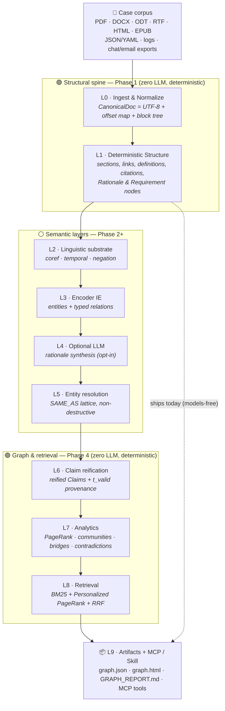
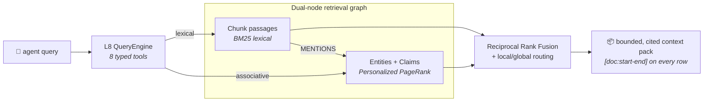
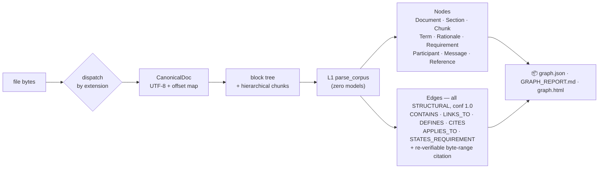
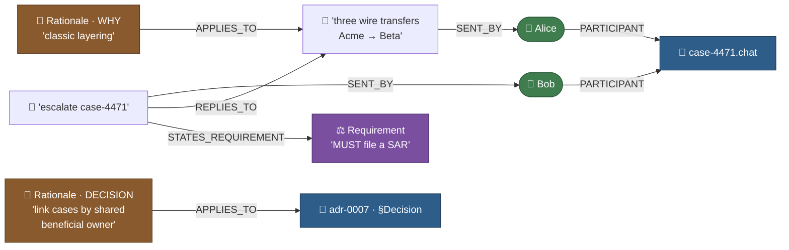

# TextGraph

[](https://pypi.org/project/textgraph-kg/)
[](https://pypi.org/project/textgraph-kg/)
[](https://github.com/krishddd/Wiki_textgraph/actions/workflows/test.yml)
[](https://github.com/krishddd/Wiki_textgraph/actions/workflows/determinism.yml)
[](https://krishddd.github.io/Wiki_textgraph/)
[](LICENSE)

> Turn a pile of case documents into a **queryable, byte-cited knowledge graph** — **deterministic & local-first by default**. Explore it in an **interactive graph studio**, derive new relations with **link prediction & Datalog rules**, and layer **opt-in LLM extraction, grounded answer synthesis, and semantic search** on top (always `GENERATED`-quarantined, never masquerading as ground truth).
>
> **`pip install textgraph-kg`**  ·  **[Live demo →](https://krishddd.github.io/Wiki_textgraph/)**  ·  **[vs. Semantica →](docs/COMPARISON_SEMANTICA.md)**

TextGraph is built to help investigators make sense of **financial-crime and technical-crime** evidence: filings, contracts, wire-transfer logs, SARs, memos, chat/email exports, and reports. It ingests that corpus and emits a structured, versioned graph that shows **who is connected to whom, through what, and — crucially — *why*** — with every edge carrying the exact source span that supports it, so a finding can be re-verified and stands up to audit.

It is the natural-language successor to [**llm-wiki**](https://github.com/krishddd/llm-wiki): where `llm-wiki` gave an agent cited, streaming answers over Wikipedia, TextGraph generalizes that to **any textual corpus** and produces a graph an agent can traverse — multi-hop relationship discovery, contradiction detection, temporal reasoning, and provenance-backed retrieval — not just a stream of prose.

## Works out of the box (zero config)

`pip install textgraph-kg` → `textgraph build ./docs` already does the investigator happy
path — **no flags, no extras, no API key, no server:**

- 📄 **PDFs ingest by default** — `pypdf` is a *core* dependency (investigators live in PDFs). `.docx`/`.html`/`.epub`/logs/chat too. (Docling layout/table/OCR is the only opt-in, in `[ingest]`.)
- 🔗 **Entity resolution is on by default** — `Acme Corporation` / `Acme Corp` / `ACME` collapse to one canonical identity via cited `SAME_AS`, so a query for one reaches facts filed under the others. Deterministic rules backend; Splink stays optional in `[er]`.
- 🔎 **Hybrid retrieval by default** — BM25 + Personalized-PageRank + RRF, every hit cited.
- 🧠 **LLM & embeddings are opt-in** — `--llm-extract`, `--narrate`, `--embed` layer on top, always `GENERATED`-quarantined; the default stays deterministic and offline.

Numbers for the PDF + entity-resolution defaults (before/after) are in [BENCHMARKS.md](BENCHMARKS.md#zero-config-defaults-pdf--entity-resolution).

## Why it's different (vs "GraphRAG")

Most GraphRAG tools build the graph *with an LLM*: extraction is non-deterministic, edges arrive without verifiable sources, and you can't reproduce or audit the result. TextGraph inverts that. The edge is **trust**, not just recall:

- **🔁 Deterministic by construction.** The same corpus always produces a **byte-identical `graph.json`** — gated in CI. You can diff two runs and reproduce any finding exactly.
- **🔍 Byte-level provenance on every edge.** Each non-generated claim carries the exact `[doc:start-end]` span that supports it, and **re-hashes against source bytes** — 100% re-verification is gated (`test_edge_provenance`). Most peers offer chunk-level attribution at best.
- **🚫 Zero LLM calls by default.** The whole pipeline — ingest → IE → resolution → claims → analytics → retrieval — runs **locally, CPU-only, no API key**. LLMs are opt-in, quarantined, and `GENERATED`-tagged so they can never masquerade as ground truth.
- **🕓 Bi-temporal versioning.** Claims carry `[t_valid, t_invalid)` windows; a later fact **invalidates** an earlier one (with a cited `SUPERSEDES` edge) rather than overwriting it — so history is queryable, not lost.
- **📏 Honest about quality.** We publish the **hallucinated-edge rate** (0.167 on the fixture, [BENCHMARKS.md](BENCHMARKS.md)) — a number most systems don't report at all.

Local-first / DuckDB stays the default; a graph DB (Neo4j) is an *optional* scale-out backend, never required. The trade is deliberate: the deterministic default caps peak recall vs an LLM extractor, which is exactly why the higher-recall `[ie]` and opt-in LLM paths exist — but the reproducibility and re-verifiable citations are the moat.

## TextGraph vs. Semantica

[Semantica](https://github.com/semantica-agi/semantica) is the closest peer — same regulated-domain focus, PROV-O provenance, decision intelligence (`record_decision` / `trace_decision_chain` / `find_similar_decisions`), conflict detection, and bi-temporal facts. Independent convergence on the same shape is a good sign. Here's the honest split ([full comparison →](docs/COMPARISON_SEMANTICA.md)):

**✅ Where TextGraph leads**

- **Byte-identical builds, gated in CI** — diff two runs, reproduce any finding. (Semantica guarantees deterministic *reasoning*, not a byte-identical *build*.)
- **Re-hashable byte-span citations** — every non-generated edge re-verifies against source bytes; 100% re-verify is gated. (Stronger than document/field-level provenance.)
- **Zero-LLM, dependency-free core** — the whole default pipeline runs CPU-only, no API key, no vector DB. LLM/embeddings are opt-in and `GENERATED`-quarantined.
- **Interop with provenance intact** — `textgraph export` emits **RDF/Turtle** (loads into Oxigraph/Jena/any SPARQL store, with cited spans as reified `rdf:Statement`s), an **OWL** vocabulary, a **SHACL** shapes graph, and a **PROV-O** decision trail — all deterministic.

**🧭 Where to improve (roadmap)**

- **Structural link prediction** — `predict_links` (Adamic-Adar / common-neighbours / resource-allocation) suggests likely-missing relations from topology, deterministically. `textgraph predict`, a **Predict links** tool in the console Ask dock, and candidate edges drawn dashed on the graph. (Node2Vec graph embeddings are still on the roadmap.)
- **LPG storage backends** — Semantica is polyglot (RDF *and* labeled-property graphs: Neo4j/Neptune/AGE). TextGraph now exports **openCypher** (`export --format cypher`) so the graph — with its `ConfidenceTag` + byte-span citations as edge properties — loads straight into Neo4j / Memgraph / AGE / Neptune, plus RDF/OWL/SHACL for triple stores. A live bidirectional driver (`serve --backend neo4j`, [designed](docs/plans/neo4j-backend.md)) is the next step.
- **Rule reasoning** — a deterministic **forward-chaining Datalog subset** (`textgraph/reasoning/`, `textgraph rules`, and a **Rules** console tool) derives new relations from recursive IF/THEN rules with a full derivation trace for every inferred fact. (Semantica also has Rete/SPARQL; those remain on the roadmap.)
- **Provider & vector-store breadth** — Semantica spans LiteLLM providers and FAISS/Qdrant/Weaviate/Milvus. TextGraph ships one OpenAI-compatible client (chat + embeddings) + a cosine index; more backends welcome.
- **Ecosystem polish** — Semantica has a hosted docs site and published benchmarks. TextGraph has an **MCP server**, a **REST API** (the console's `/api/*`), a **live demo**, and honest fixture benchmarks ([BENCHMARKS.md](BENCHMARKS.md)) — and is growing the rest.

The design rule that keeps the moat while closing the gap: **the LLM augments, it never becomes ground truth** — anything model-authored is `GENERATED`-tagged next to its re-verifiable citations.

## Who it's for

- **Financial-crime analysts** — trace structuring/layering, link cases through a shared beneficial owner, follow the money across accounts, and answer *why* two cases are related with a cited path.
- **Fraud & technical-crime investigators** — correlate logs, tickets, chat threads, and reports; surface the decision/rationale trail behind an incident.
- **Compliance & audit** — every non-generated claim re-hashes against its source bytes, so evidence is re-verifiable and retained (not silently rewritten).
- **Coding & research agents** — via MCP tools that return bounded, ranked, cited context instead of a bag of similar chunks.

## Supported formats

Investigators don't get clean markdown — they get PDFs, Word docs, and exports. L0 ingests, deterministically:

| Class | Formats | Default install |
|---|---|---|
| Markup / notes | `.md` `.markdown` `.mdx` `.txt` | ✅ built-in |
| Rich documents | `.docx` `.odt` `.rtf` `.html`/`.htm` `.epub` | ✅ built-in (stdlib parsers) |
| Structured data | `.json` `.yaml`/`.yml` `.toml` | ✅ built-in |
| Logs | `.log` (template mining) | ✅ built-in |
| Conversations | `.chat` `.transcript` (speaker turns) | ✅ built-in |
| PDF (text layer) | `.pdf` | ✅ built-in (pypdf) — investigators live in PDFs |
| PDF layout / tables / OCR | scanned or complex `.pdf` | `pip install 'textgraph-kg[ingest]'` (Docling) |

Unknown extensions fall back to plain text; a format needing a missing extra is **skipped with a warning**, never a crash (G2). For rich formats the *extracted* text becomes the canonical document, and every citation still re-verifies against it.

## Quickstart

> New here? **[docs/RUNNING.md](docs/RUNNING.md)** is the step-by-step guide — which Python,
> which requirements file, how to install with `pip` **or** `uv`, how to build a graph, and
> how to open the interactive UI.

```bash
pip install textgraph-kg          # the import package + CLI are named `textgraph`
```

**Python API** — build once, then call the eight typed, cited tools:

```python
from textgraph.pipeline import build
from textgraph.l8_retrieval import QueryEngine

result = build("./case-files")  # deterministic; byte-identical graph.json
engine = QueryEngine(result.nodes, result.edges)

hits = engine.search("who transferred funds to whom", k=5)
for h in hits.hits:
    print(h.name, "→", [c.ref() for c in h.citations])  # every hit re-verifiable

engine.path("Acme Corp", "Gamma Holdings")  # max-likelihood cited path
engine.why("Acme Corp")  # cited claims + validity windows
engine.conflicts()  # single-truth conflicts, surfaced not merged
engine.trace_decision_chain("beneficial owner policy")  # decision lineage
```

**CLI** — the same tools from the shell:

```bash
# ...or from source (dev): pip install -r requirements.txt && pip install -e .
textgraph build ./case-files -o textgraph-out
# → textgraph-out/graph.json, GRAPH_REPORT.md, graph.html, schema.yaml, manifest.json

# Then query the graph directly — bounded, byte-cited answers, no LLM required:
textgraph query   ./case-files "who transferred funds to whom"
textgraph path    ./case-files "Acme Corp" "Gamma Holdings"
textgraph explain ./case-files "Acme Corp"           # cited claims + validity windows
textgraph timeline ./case-files "Acme Corp"          # what was true, and when it changed
textgraph contradictions ./case-files                # conflicting assertions, cited

# Keep the graph in sync with a live case folder (incremental, only re-extracts edits):
textgraph watch ./case-files -o textgraph-out

# ...or open the interactive graph console (canvas viewer + all eight tools):
textgraph console ./case-files          # -> http://127.0.0.1:8765

# For a denser, meaning-rich map, build with LLM relation extraction first, then serve it:
textgraph build ./case-files --llm-extract --llm-extract-budget 200 -o ./case-out
textgraph console ./case-out            # shows every LLM-extracted X -PRED-> Y relation

# ...or query it in standard GQL (ISO/IEC 39075 / Cypher subset):
textgraph gql ./case-files "MATCH (a:Organization)-[:CONTROLS*1..3]->(b) RETURN a.name, b.name"
```

The console is a clean, spacious viewer that surfaces your data at a glance: a row of **stat cards** (entities · relations · communities · time points), a **NotebookLM / Semantica-style mind-map** — nodes coloured by entity type (with a legend) and sized by PageRank, self-organised by a client-side force layout so connected entities cluster and the map fills the whole panel (a ↔ toggle collapses the side panel for full width). When a build has few explicit relations, the console links entities that **co-occur in the same passage** so the graph still spreads instead of scattering; opt-in **LLM-extracted relations are always shown** (their endpoints are pulled into view regardless of PageRank rank, so the meaningful `X →REGULATES→ Y` edges surface). Alongside: an **"Ask" chat dock** — ask a question in plain English and it routes to the right graph tool, answers with cited evidence (and a collapsible reasoning chain), and highlights the answer on the graph beside it (with an opt-in **Narrate (LLM)** mode for grounded prose) — a **Top-entities-by-PageRank** list, a communities panel with per-cluster toggles, a confidence-tag filter (so `GENERATED` output stays visibly quarantined), search that highlights matches, **click-to-inspect** for a node's cited claims and validity windows, in-UI **document management** (attach / remove with `--allow-ingest`), a path mode that traces the maximum-likelihood chain between two entities, a time slider that scrubs superseded relations, and a light / dark toggle. The browser only ever *draws* and *arranges* the graph the server ships — no CDN, no framework, no third-party JS; `graph.json` stays byte-identical. The offline `graph.html` artifact is the exact same viewer. See **[docs/RUNNING.md](docs/RUNNING.md)** for a walkthrough.

Open `GRAPH_REPORT.md` for orientation (god nodes, communities, contradictions, and **10 questions the graph can answer well**), or `graph.html` for a self-contained, click-to-source-span explorer. Agents drive the same eight typed tools over MCP — see [`textgraph.mcp`](textgraph/mcp/).

## Why it exists

`llm-wiki` proved the value of citation-grounded, MCP-exposed knowledge retrieval. TextGraph extends that tool along three axes:

| llm-wiki | TextGraph |
|---|---|
| Answers over Wikipedia | Ingests **any** textual corpus |
| Streamed prose with sources | **Queryable knowledge graph** with byte-range citations on every edge |
| LLM-in-the-loop | **Zero LLM calls required** — deterministic parsers + encoder IE by default (`--no-llm` always works) |
| Point-in-time answer | **Bi-temporal** — what is true, what *was* true, when it changed, and why |

## The one-paragraph pitch

TextGraph turns any body of text into a queryable knowledge graph with byte-level provenance on every claim. Extraction runs entirely on the user's machine using deterministic structural parsers and encoder-based information-extraction models — no LLM calls are required and text never leaves the machine by default. Every edge is tagged `STRUCTURAL`, `EXTRACTED`, `INFERRED`, or `GENERATED`, carries the exact source span that supports it, and is versioned bi-temporally so an agent can ask not just *what is true*, but *what was true, when it changed, and why*.

## Design goals (non-negotiable)

- **G1 — Determinism.** Same corpus + same version ⇒ byte-identical `graph.json`.
- **G2 — Local-first.** Zero network calls by default; any LLM pass is opt-in.
- **G3 — Provenance.** No assertion without a re-verifiable byte-range citation.
- **G4 — Confidence stratification.** Every edge tagged `STRUCTURAL / EXTRACTED / INFERRED / GENERATED`.
- **G5 — Incrementality.** One changed file never forces a full rebuild.
- **G6 — Agent-legible output.** Bounded, ranked, cited context packs — never raw Cypher.
- **G7 — Bounded, auditable cost.** Per-stage token/time/dollar budgets in a run manifest.

## Architecture at a glance

A strictly bottom-up layer stack. Each layer is a **pure function of the layer below it plus a pinned config hash** — the single property that makes determinism (G1) and incrementality (G5) achievable. `L0 → L1` (the structural spine) is implemented and ships today; the semantic and retrieval layers land in later phases.



## Status

🟢 **v4.6.0 — openCypher export → Neo4j.** `textgraph export --format cypher` emits a deterministic load script that recreates the graph — citations and confidence tags included — in Neo4j / Memgraph / AGE / Neptune. The DB is a downstream materialization target; the build stays local & deterministic.

🟢 **v4.5.0 — graph interaction polish.** Click glides the camera with a selection halo, click-again / Escape undoes, the top search pans to matches, and Group lays communities out as separated readable clusters.

🟢 **v4.4.0 — studio-style console chrome.** A left rail, a segmented top toolbar, and collapsible inspector sections give the console a clean knowledge-studio layout.

🟢 **v4.3.0 — forward-chaining rule engine (Datalog).** Derive new relations from recursive IF/THEN rules with a full derivation trace: `textgraph rules`, a **Rules** console tool, and `QueryEngine.apply_rules`. Closes the Semantica reasoning-engine gap.

🟢 **v4.2.0 — ego / distance-intelligence view.** An **Ego** toggle colours the graph by hop-distance from a clicked focus node (0h / 1h / 2–3h / 4+h) with a live depth slider — a distance map for exploring a node's structural reach.

🟢 **v4.1.0 — structural link prediction.** Suggest likely-missing relations from graph topology (Adamic-Adar and friends), deterministically: `textgraph predict`, a **Predict links** tool in the console, and dashed candidate edges on the graph. Closes the last big Semantica KG-engine gap (Node2Vec embeddings aside).

🟢 **v4.0.0 — NotebookLM-style graph console.** The web console now self-organises into a mind-map: a client-side force layout clusters connected entities and fills the panel, a co-occurrence backbone connects entities that share a passage so even a relation-sparse build spreads, and opt-in **LLM-extracted relations are always shown** (their endpoints are pulled into view regardless of PageRank, so the meaningful `X →REGULATES→ Y` edges surface). `build --llm-extract-budget N` dials the LLM relation density. `graph.json` and the determinism/provenance gates are untouched.

🟢 **v1.0.0 — the full L0–L9 stack is shipped** (deterministic ingest → IE → resolution → bi-temporal claims → analytics → hybrid retrieval → optional LLM, with CLI, MCP, and a local web console).

- **L0 ingestion** across markdown, plain text, HTML, DOCX, ODT, RTF, EPUB, JSON/YAML/TOML, logs, and transcripts (PDF behind the `[ingest]` extra), each producing a `CanonicalDoc` + span-carrying block tree + hierarchical chunks.
- **L1 structure parse** (zero models): sections, links, definitions, citations, cross-references, transcript threads, log templates, structured fields, and **Rationale / Requirement nodes** (WHY / DECISION / MUST / SHALL …). Every edge is `STRUCTURAL` with a re-verifiable byte-range citation.
- **L2 + L3 encoder IE** — the build now extracts **entities** (Organization, Person, Money, Account, Date, Email) and **typed relations** (`TRANSFERRED` with amount, `CONTROLS`, `BENEFICIAL_OWNER_OF`, `DIRECTOR_OF`, `ASSOCIATED_WITH`), tagged `EXTRACTED`. Coreference-lite resolves `it`/`the company` to the nearest org (relations so resolved are tagged `INFERRED`), and **negation/modality are preserved** (`did not transfer` → negated; `may be linked` → hedged). The default backend is deterministic and model-free (CPU-only, CI-safe); a higher-recall GLiNER backend lives behind the `[ie]` extra and runs an **int8-quantized ONNX** model so it's usable on CPU (GLiNER supplies the NER; relations reuse the same deterministic extractor, so recall rises with no new nondeterminism).
- **L5 entity resolution — on by default, no extra needed.** Alias entities collapse to one canonical identity out of the box: `Acme Corp` / `Acme Corporation` / `ACME` → **"Acme Corporation"**, linked non-destructively via `SAME_AS` (tagged `INFERRED`, reversible, span-cited). Deterministic blocking (suffix-stripped / acronym / token keys) → Jaro-Winkler + **relational shared-neighbour** scoring → complete-linkage clustering that blocks the over-merge catastrophe — all pure-Python, zero heavy dependencies. `textgraph er audit` surfaces every proposed merge; B-cubed F1 is gated in CI. Splink (Fellegi-Sunter) stays the *opt-in* higher-recall `[er]` backend — it's a heavier dependency, so it's never forced on the default install.
- **L6 claim reification** — every relation edge becomes a first-class, citable **`Claim`** node (subject/predicate/object/polarity/modality/confidence) with a shallow temporal window: `t_valid` is grounded to the nearest `Date` in the same sentence (full bi-temporal invalidation is Phase 5). The direct edge is kept, so traversal is unchanged; the Claim is what makes *why* / *timeline* / *contradictions* answerable.
- **L7 analytics** (pure-Python, deterministic) — weighted **PageRank** + **Brandes betweenness**, **label-propagation communities** with automatic c-TF-IDF labels, plus diagnostics folded straight into the graph: centrality/community written onto entity nodes, **god nodes** (central on both measures), **bridges**, orphans, and **contradictions** surfaced as `CONTRADICTS` edges. Leiden is the optional `[graph]` upgrade.
- **L8 retrieval** — the **HippoRAG-style dual-node graph** (entities + `Chunk` passages) powers eight typed, bounded, **cited** tools: `search` (hybrid pure-Python **BM25 + Personalized PageRank fused with RRF**, local/global routing), `neighbors`, `path` (maximum-likelihood, shortest under `-log(confidence)`), `why`, `timeline`, `contradictions`, `communities`, `stats`. Every result is a token-budgeted context pack where each row carries a `[doc:start-end]` byte citation — never raw Cypher (G6).
- **MCP + CLI** — the same `QueryEngine` drives the MCP tool surface (`textgraph.mcp`, stdio server behind the `[mcp]` extra) and three new CLI verbs: `textgraph query`, `textgraph path`, `textgraph explain`.
- **L9 artifacts**: byte-stable `graph.json` (now including Claims, Chunks, centrality/community properties, and CONTRADICTS edges), `GRAPH_REPORT.md` (entities, relationships, resolved SAME_AS clusters, **communities**, **contradictions**, 10 grounded questions), a self-contained `graph.html` explorer, `schema.yaml`, and `manifest.json` (per-layer L0–L8 counts + coref/blocking stats). First retrieval **[benchmark](BENCHMARKS.md)** publishes recall@k / MRR *with* tokens-per-query and latency ("no number without its cost").
- CI gates all of it: lint, strict types, a byte-identical **determinism** gate (models pinned/seeded), 100% edge-provenance re-verification across the full four-tier taxonomy, a B-cubed ER-quality floor, and a tool-only **agent-session** integration test.



### What Phase 1 does to each file



### What you get (example: an AML case)

**The structural spine (L1)** over the `chat` + `adr` fixtures — cited, and already answering *why*:



> Edges shown are exactly what L1 emits, each carrying a re-verifiable byte-range citation. `SENT_BY` points message → participant, `PARTICIPANT` participant → document, `APPLIES_TO` rationale → the block it justifies.

**The entities & relationships (L2 + L3)** — now extracted from `wire-transfers.md`. "Acme Corp wired $2,000,000 to Beta Ltd" becomes a real `Organization → TRANSFERRED → Organization` edge:


> Solid edges are `EXTRACTED`; dotted are `INFERRED` (coref) or carry a preserved `polarity`/`modality` attribute (negated / hedged) — never silently dropped. Every edge still cites the exact source span. The default extractor is deterministic and model-free; GLiNER (`[ie]`) is a higher-recall drop-in.

> **Phase 3 update:** `Acme Corp`, `Acme Corporation`, and `ACME` now collapse into one canonical **"Acme Corporation"** node via reversible `SAME_AS` links, while `Alpha Bank` stays separate. Run `textgraph er audit ./case-files` to review every proposed merge with its match score.

> **Phase 4 update:** the graph is now queryable. Ask it directly — every answer comes back bounded and byte-cited:
>
> ```bash
> textgraph query   ./case-files "who transferred funds to whom"
> textgraph path    ./case-files "Acme Corp" "Gamma Holdings"   # maximum-likelihood chain
> textgraph explain ./case-files "Acme Corp"                     # cited claims, with t_valid
> ```

> **Phase 5 update:** the graph is now bi-temporal and incremental. Corrections *invalidate* rather than delete — `Acme Corp transferred $1M to Beta Ltd` (2026-05-01) is superseded by a dated correction, its window closed to `[2026-05-01, 2026-06-01)` with a cited `SUPERSEDES` edge, and `textgraph timeline` shows both. `textgraph watch ./case-files` keeps artifacts in sync, re-extracting only edited files; `textgraph build --store g.duckdb` persists the graph so it reloads without a rebuild.

> **Phase 6 (in progress):** the opt-in LLM pass (L4) has landed. It's **off by default** — when enabled it summarizes the graph's communities and tags every summary `GENERATED`, so model output is quarantined and can never be mistaken for a cited fact (and `graph.json` stays byte-identical whenever the LLM is off):
>
> ```bash
> export API_KEY=…                       # read from the env only, never persisted
> export MODEL_BASE_URL=https://…/v1     # OpenAI / vLLM / Ollama — any /chat/completions
> export MODEL_NAME=your-model
> textgraph build ./case-files --llm     # adds GENERATED community summaries
> ```

> **Phase 6 update:** the opt-in LLM pass (L4, `GENERATED`-tagged, off by default) and a dependency-free local **`textgraph console`** web UI have landed — all eight typed tools in the browser, every row cited.

> **Phase 7 update:** TextGraph now speaks **standard GQL** (ISO/IEC 39075 / Cypher subset) — `textgraph gql ./case-files "MATCH (a)-[:CONTROLS*1..3]->(b) RETURN a.name, b.name"` — property-graph pattern matching with quantified paths, over the same graph the typed tools query. Read-only, so determinism and provenance are untouched.

> **Phase 8 update:** **vision-native retrieval** — `textgraph vision ./case-files "who moved the money"` ranks documents-as-pages with the ColPali-style **MaxSim** late-interaction operator. The default embedder is deterministic and CI-safe (zero GPU); a real ColPali/ColQwen model over rendered page images sits behind the `[vision]` extra. Query-time only, so `graph.json` is untouched.

> **Phase 9 update:** **enterprise fine-grained access control** — attach a policy and query as a principal: `textgraph secure ./case-files "who moved the money" --policy policy.json --principal alice`. ReBAC (Zanzibar/OpenFGA relation tuples) + ABAC (clearance / IP / time window) are enforced *inside* traversal — an unauthorized document's nodes get a **zero** PPR transition probability, so they can't leak through search, paths, or summaries. Pure-Python default; a real OpenFGA service sits behind the `[security]` extra. With no policy the engine is byte-identical, so `graph.json` and the default install are untouched.

> **Phase 10 update:** **Graph-of-Thoughts reasoning** — `textgraph reason ./case-files "how is Acme Corp connected to Delta Trust"` builds a graph of thought vertices (Plan → SubProblem → Hypothesis → VerificationStep → DistilledSummary) whose every step is **bound to real graph evidence** via `neighbors`/`path`/`why`/`gql` and cites re-verifiable `[doc:span]` bytes (ESCARGOT). It's **complexity-gated** (DGoT/AGoT): simple questions run a cheap linear chain, hard ones spawn the Aggregation/Refinement branches — ~70% fewer tool calls than a static-topology baseline at equal grounding. Deterministic and read-only.

**🎉 v1.0.0 is out** — the full L0–L9 stack, shipped, plus the v1.1 interactive console and Phases 7–10 (GQL, vision retrieval, access control, Graph-of-Thoughts). See the [CHANGELOG](CHANGELOG.md) for details and [PLAN.md](PLAN.md) for the full roadmap.

## Specification documents

- [`textgraph-engineering-research.md`](textgraph-engineering-research.md) — the primary engineering specification (L0–L9 stack, model choices, storage, retrieval, evaluation).
- `TextGraph_Engineering_Blueprint.pdf` — slide-deck rendering of the architecture (visual cross-check + UI reference).
- `TextGraph Architecture Gap Analysis.docx` — enterprise extension research (GQL surface, vision-native ingestion, fine-grained access control, Graph-of-Thoughts).

## Related work

- [llm-wiki](https://github.com/krishddd/llm-wiki) — the predecessor tool this project extends.
- **Graphify** — the closest prior art (tree-sitter over *code*); TextGraph recovers its guarantees (determinism, locality, provenance, cost linearity) for the domain of arbitrary natural language.

## License

MIT
